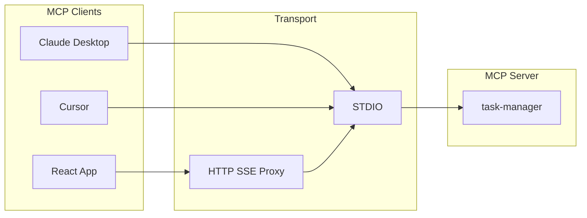

# Product Requirements Document – MCP Task Manager Extension and Educational React Client

**Author:** chloe  
**Date:** 2026-03-17

---

## Executive Summary

**Vision:** Extend the existing todo-mcp-server (task-manager MCP server) with deadlines, markdown-table resources, MCP Prompts, and an educational React app that acts as an MCP client. The React app teaches the Model Context Protocol (MCP) by exposing Resources, Tools, and Prompts in a single UI with in-app explanations. **AG Grid is a core part of the app:** tabular data is presented in AG Grid as much as possible (even when markdown or Mermaid would be more natural) so the project doubles as an AG Grid learning exercise.

**Differentiator:** The front-end is explicitly educational and **grid-first**: it uses MCP terminology (Resource, Tool, Prompt, List, Read, Call, Invoke) and prefers AG Grid for presenting any tabular data—supporting the author’s goal to become familiar with AG Grid. This is a **personal learning project**; product decisions favour learning MCP and AG Grid.

**Target users:** The author (and optionally other developers/learners) who want to understand MCP and AG Grid by seeing and using Resources, Tools, and Prompts in a concrete, visual way.

**Scope in one sentence:** One MCP server (extended with deadlines, markdown resources, and prompts), one HTTP/SSE proxy for browser access, and one React app that discovers and uses all server capabilities, presents data primarily in AG Grid, and teaches MCP concepts.

---

## Success Criteria

| ID | Criterion | Measurement |
|----|-----------|-------------|
| SC1 | User understands MCP Resources | User can list resources, read by URI, and see in-app copy that explains "Resources are read-only data by URI." |
| SC2 | User understands MCP Tools | User can list tools, call a tool with arguments, and see confirmation that "You used a Tool; server state changed." |
| SC3 | User understands MCP Prompts | User can list prompts, invoke a prompt with optional args, and see returned markdown with copy that "This came from a Prompt." |
| SC4 | User can manage tasks with deadlines | User can create/update tasks with optional due date and see task data primarily in AG Grid (markdown as fallback where needed). |
| SC6 | AG Grid is primary data presentation | Tabular data from resources, tools, and prompts is shown in AG Grid by default (parse markdown/JSON into grid); author gains practice with AG Grid patterns. |
| SC5 | Existing clients unaffected | Claude Desktop and Cursor continue to use the MCP server via STDIO with no breaking changes. |
| SC7 | User understands how AI agents use MCP | User can type a plain-language request, see the AI select and execute an MCP operation, and read an explanation of what capability was used and why. |

---

## Product Scope

### MVP (In Scope)

- **MCP server:** Task model with optional `dueDate`; `create_task` and `update_task`; markdown-table resources (`task://table/*`, `task://open`); prompts capability with `tasks_table`, `tasks_summary_for_stakeholders`, `completions_by_date`.
- **Proxy:** Single process that spawns the task-manager server over STDIO and exposes HTTP/SSE (or WebSocket) to the browser; forwards MCP JSON-RPC.
- **React app:** Connect to proxy; list and read Resources with educational copy; list and call Tools with schema-based forms; list and get Prompts with argument forms; **AG Grid as primary way to present tabular data** (resource reads, tool results, prompt results—parse markdown/JSON into grid); consistent MCP terminology and short explanations after key actions.
- **LLM integration:** Chat interface in React app; proxy-side LLM endpoint that interprets natural language and maps to MCP operations; results in AG Grid with educational explanation of what the AI did. Ollama (local) as default LLM provider.

### Growth / Optional (Post-MVP)

- Resource `task://chart/completions-by-date` (markdown/Mermaid).
- "About MCP" / glossary or diagram section in the React app.
- Date-range arguments for prompts (e.g. `from`/`to` for completions).

---

## User Journeys

### Journey 1: Learner discovers MCP capabilities (Resources, Tools, Prompts)

**Actor:** Developer or learner new to MCP.  
**Goal:** Understand what Resources, Tools, and Prompts are by using them.  
**Flow:** Open the React app → see three sections (Resources, Tools, Prompts) with short educational blurbs → list Resources and read one (e.g. `task://table/by-deadline`) → see data in **AG Grid** (parsed from markdown/JSON) and explanation that this was a "Read" of a "Resource" → list Tools and call `create_task` with title, priority, dueDate → see success and note that "You used a Tool" → list Prompts and invoke `tasks_table` with sort → see result in **AG Grid** and note that "This came from a Prompt."  
**Success:** User can articulate the difference between reading a Resource, calling a Tool, and invoking a Prompt, and sees tabular data primarily in the grid.

### Journey 2: User manages tasks and views them in multiple ways

**Actor:** Same learner or developer.  
**Goal:** Create and update tasks with deadlines and view them as markdown tables or in a grid.  
**Flow:** Call `create_task` with due date and priority → read `task://table/by-deadline` or `task://all` and see task data in **AG Grid** by default → call `update_task` to change due date or status → refresh and see updated data in the grid.  
**Success:** User can create, update, and view tasks primarily in AG Grid, with deadlines and priority; markdown is fallback only where needed.

### Journey 3: Claude Desktop / Cursor user (unchanged)

**Actor:** User of Claude Desktop or Cursor with the task-manager MCP server.  
**Goal:** Use existing tools and resources via STDIO.  
**Flow:** No change to current usage; server still speaks STDIO; new resources and prompts are additive.  
**Success:** No regression; existing integrations keep working.

---

## Functional Requirements

### Task data model and tools (MCP server)

| ID | Requirement | Acceptance criteria |
|----|-------------|---------------------|
| FR1 | The server exposes a Task model with optional `dueDate` (ISO date or datetime). | Task type includes `dueDate?: string`; existing fields (title, description, status, priority) unchanged. |
| FR2 | The client can create a task with optional `dueDate` via a create-task tool. | `create_task` accepts optional `dueDate`; new tasks persist with due date when provided. |
| FR3 | The client can update task fields (e.g. dueDate, priority, title, description, status) via an update tool. | An `update_task` (or equivalent) tool accepts optional `dueDate`, `priority`, `title`, `description`, `status`; changes persist. |

### Markdown and table resources (MCP server)

| ID | Requirement | Acceptance criteria |
|----|-------------|---------------------|
| FR4 | The server exposes a resource that returns all tasks as a markdown table (ID, Title, Priority, Due, Status). | URI `task://table/all` exists; `resources/read` returns `mimeType: "text/markdown"` and a valid markdown table. |
| FR5 | The server exposes a resource that returns the same columns sorted by due date. | URI `task://table/by-deadline` exists; rows sorted by `dueDate` (nulls last or first, consistent). |
| FR6 | The server exposes a resource that returns the same columns sorted by priority. | URI `task://table/by-priority` exists; rows sorted by priority (e.g. high → medium → low). |
| FR7 | The server exposes a resource that returns the same columns sorted by priority then due date. | URI `task://table/priority-then-deadline` exists; sort order is priority first, then due date within priority. |
| FR8 | The server exposes a resource that returns only todo and in-progress tasks as markdown. | URI `task://open` exists; returns markdown table or list of open tasks only. |
| FR9 | The server continues to expose existing JSON and summary resources for backward compatibility. | `task://all` (JSON) and `task://summary` (text) remain available and unchanged in behavior. |

### Prompts (MCP server)

| ID | Requirement | Acceptance criteria |
|----|-------------|---------------------|
| FR10 | The server declares the prompts capability and implements `prompts/list` and `prompts/get`. | Server capabilities include `prompts: {}`; `prompts/list` and `prompts/get` respond per MCP SDK schemas. |
| FR11 | A prompt returns the tasks markdown table for a given sort. | Prompt (e.g. `tasks_table`) accepts argument `sort` ("deadline" \| "priority" \| "priority-then-deadline"); returns one user `PromptMessage` with that markdown table. |
| FR12 | A prompt returns a short markdown summary for stakeholders. | Prompt (e.g. `tasks_summary_for_stakeholders`) returns a user message with counts by status, overdue count, and optional small table of overdue tasks. |
| FR13 | A prompt returns completed tasks by date (table or chart). | Prompt (e.g. `completions_by_date`) accepts optional `from`/`to`; returns user message with markdown table or Mermaid of completed tasks by date. |

### Transport (proxy)

| ID | Requirement | Acceptance criteria |
|----|-------------|---------------------|
| FR14 | A proxy process allows the browser to talk to the MCP server. | Proxy spawns task-manager as subprocess over STDIO; exposes HTTP + SSE (or WebSocket) to the browser; forwards MCP JSON-RPC between browser and server. |
| FR15 | The React app connects only to the proxy. | React app uses proxy URL (e.g. `http://localhost:3xxx` in dev); no direct STDIO from browser. |
| FR16 | The core MCP server still uses STDIO for Claude Desktop and Cursor. | No change to server STDIO transport; proxy is an additional path for browser clients. |

### React app – discovery and education

| ID | Requirement | Acceptance criteria |
|----|-------------|---------------------|
| FR17 | The app lists Resources with MCP terminology and a short explanation. | On load (or section load), app calls `resources/list` and displays URI, name, description; visible blurb explains "Resources are read-only data by URI. Click to Read." |
| FR18 | The app lists Tools with MCP terminology and a short explanation. | App calls `tools/list` and displays name, description, input schema; visible blurb explains "Tools are actions you can invoke with arguments. Fill the form and Call a tool." |
| FR19 | The app lists Prompts with MCP terminology and a short explanation. | App calls `prompts/list` and displays name, description, arguments; visible blurb explains "Prompts are pre-built messages the server returns. Invoke a prompt to get that content." |

### React app – using capabilities

| ID | Requirement | Acceptance criteria |
|----|-------------|---------------------|
| FR20 | The user can read a resource and see the result; tabular data is shown in AG Grid by default. | Selecting a resource triggers `resources/read` with that URI; when the result is tabular (JSON array of tasks or markdown table), parse and show in AG Grid; offer raw markdown as fallback if needed. |
| FR21 | The user sees JSON and markdown-table resources in the grid by default. | For `application/json` task arrays and for `text/markdown` tables, app parses and displays data in AG Grid; markdown view is secondary/optional. |
| FR22 | The user can call a tool from a form derived from its input schema. | For each tool, form fields match `inputSchema` (e.g. create_task: title, description, priority, dueDate); submit calls `tools/call` and shows result. |
| FR23 | After a mutating tool call, the app can refresh and show a short educational note. | After create_task or update_task, app can refresh resource list or selected resource and show note: "You just used a Tool; the server state changed." |
| FR24 | The user can invoke a prompt with optional arguments; tabular results are shown in AG Grid. | User selects prompt, optionally fills arguments (e.g. `tasks_table` sort); invoke calls `prompts/get`; when the returned message is a markdown table (or parseable as tabular data), display in AG Grid with a line like "This content came from a Prompt—shown here in the grid." Raw markdown as fallback. |

### React app – AG Grid and polish

| ID | Requirement | Acceptance criteria |
|----|-------------|---------------------|
| FR25 | AG Grid is the primary way to present tabular data from any source. | All tabular data (from resources, tool results, prompt results) is shown in AG Grid where feasible. Grid shows columns: ID, Title, Description, Status, Priority, Due date, Created; client-side sort/filter; support switching data source and refreshing. |
| FR26 | The grid view is linked to MCP concepts in the UI. | Educational note near grid: "This grid shows data Read from a Resource (or returned by a Tool / Prompt). We're using AG Grid as much as possible so you can learn it while learning MCP." |
| FR27 | MCP terms are used consistently across the app. | Copy uses Resource, Tool, Prompt, List, Read, Call, Invoke, URI, input schema, arguments consistently. |
| FR28 | Key actions have in-app explanations. | After list/read/call/invoke, short copy explains what happened (e.g. "You read task://table/by-deadline," "You invoked the tasks_table prompt"). |

### Natural language MCP interaction (LLM)

| ID | Requirement | Acceptance criteria |
|----|-------------|---------------------|
| FR29 | The React app includes a chat interface where users type natural language requests about tasks. | A text input and conversation area are visible; user can type requests like "show me overdue tasks sorted by priority." |
| FR30 | An LLM endpoint on the proxy accepts user text plus available MCP capability descriptions and returns a structured intent (which MCP operation to call, with what arguments, and a human-readable explanation). | Proxy exposes an endpoint (e.g. `POST /llm/interpret`); calls a configurable LLM provider (Ollama at `http://localhost:11434` by default); `LLM_BASE_URL` and `LLM_MODEL` env vars on proxy. |
| FR31 | The app executes the LLM-selected MCP operation and displays results in AG Grid, with educational copy explaining which MCP capability was used. | After LLM interpretation, the app calls the corresponding MCP method and shows results in the grid with a note like "The AI read resource task://table/by-priority to answer your question." |
| FR32 | The chat interface maintains conversation history within the session and supports multi-turn context. | Prior messages are visible; the LLM receives conversation context so follow-up requests like "now sort those by deadline instead" work. |

---

## Non-Functional Requirements

### Educational first (NFR1)

- UI copy and flow teach MCP concepts; the app is a learning tool as well as a functional client.  
- **Measurement:** Each of Resources, Tools, and Prompts has at least one visible explanatory blurb and at least one post-action explanation.

### Compatibility (NFR2)

- Existing Claude Desktop and Cursor usage of the MCP server via STDIO continues to work; all new behavior is additive.  
- **Measurement:** No removal or breaking change to existing resources or tools; existing `task://all` and `task://summary` and current tools behave as before.

### AG Grid first – learning (NFR3)

- This project is for personal learning. In the React app, prefer AG Grid over markdown or Mermaid for presenting data whenever the data can be shown in a grid—even when markdown would be more natural—so the author can practise AG Grid (column defs, sorting, filtering, multiple data sources).  
- **Measurement:** Tabular data from resources, tools, and prompts is displayed in AG Grid by default; markdown/Mermaid only as fallback or alongside.

### Tech stack (NFR4)

- React front-end; **AG Grid as the primary data-presentation layer**; MCP client over HTTP/SSE (or WebSocket) to the proxy; server and proxy remain TypeScript/Node.  
- **Measurement:** Delivered artifacts include a React app (with AG Grid as core for data display), a proxy process, and the extended Node/TS MCP server.

---

## Traceability

| Source | PRD section |
|--------|-------------|
| Plan §1 (Product context and goals) | Executive Summary, Success Criteria |
| Plan §2.1 (Data model, resources, prompts) | FR1–FR13 |
| Plan §2.2 (Proxy) | FR14–FR16 |
| Plan §2.3 (React app) | FR17–FR28 |
| Sprint change proposal 2026-03-19 | FR29–FR32, SC7 (LLM natural language MCP interaction) |
| Plan §3 (Non-functional) | NFR1–NFR4 |
| Plan §5 (Epics) | Scope (MVP vs optional); stories can be derived from FRs |

---

## Architecture overview (reference)

- Single MCP server: Resources, Tools, Prompts; STDIO only.
- Proxy: Node process; spawns task-manager, speaks STDIO; exposes HTTP/SSE to browser; forwards JSON-RPC.
- React app: MCP client (list/read resources, list/call tools, list/get prompts); educational copy; **AG Grid as primary way to present data** (resources, tools, prompts) for learning.
